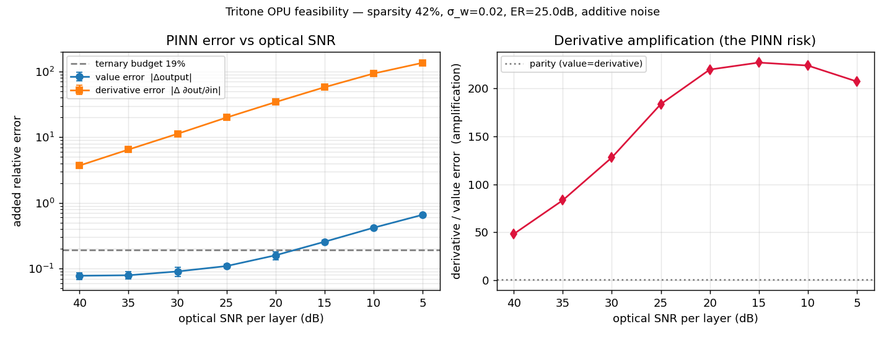

# Should Tritone get an Optical Processing Unit layer? — Final Report

**Method:** BMAD pipeline (Analyst → PM → Architect → SM → Dev → QA, two gates), miras-backed.
**Question:** Could an analog **Optical Processing Unit (OPU)** replace Tritone's ternary MAC array
without destroying the PINN accuracy that is the project's whole point?
**Answer in one line:** **Yes for inference of the output *values*, no for anything needing *derivatives*.**
An OPU is worth pursuing *only* as an inference-only accelerator for a frozen, pre-trained ternary PINN.

---

## 1. What we did
Rather than reason about photonics in the abstract, we ran the cheap experiment first (≈29 s, numpy, no GPU):
a faithful **bit-exact** model of Tritone's integer ternary MAC and 7-layer PINN topology, with a
physically-motivated **optical-noise model** layered on the matmuls, swept over optical SNR.

- **Real, not invented:** ternary MAC semantics (`host/tpu_driver.py`), the 7-Dense architecture
  (110→512→[512→512→512]+skip→[512→128,128→128,512→128]+skip→128→5 sigmoid), the 5 outputs
  (`g_Na, g_K, g_Ca, omega, coupling`), τ=0.7 ternarization (measured sparsity **42.4 %**), and the
  project's existing **19.4 %** ternarization accuracy budget.
- **Modeled optical effects (each switchable, each unit-tested):** additive readout noise (SNR-parameterized),
  static ±1 weight/phase error, finite extinction-ratio leakage on the `0` state, optional crosstalk.
- **Two metrics:** output **value** error (the project's headline metric) and **derivative** error
  `∂outputs/∂inputs` (the PINN-critical one).

The work passed an **independent QA audit** that re-ran everything; it caught one real overclaim (below),
which we **fixed** rather than papered over.

## 2. Results

| Optical SNR / layer | Value error | Derivative error |
|---:|---:|---:|
| 40 dB (near-clean) | **7.8 %** | 3.7 (370 %) |
| 25 dB | 10.9 % | 20× |
| **18.2 dB** | **≈19 % (budget)** | ~45× |
| 10 dB | 41.8 % | 93× |

**Three robust, ε-independent findings the verdict rests on:**
1. **Values survive at reachable SNR.** Added value error stays under Tritone's existing 19 % ternary
   budget down to **SNR ≈ 18 dB/layer** — comfortably inside demonstrated optical-neural-net ranges
   (~15–25 dB). Ternary genuinely helps here: 3 well-separated levels are easy for optics, and the 42 %
   zeros are *no light path* (no energy, no noise).
2. **Derivatives do not.** A fixed **2 % photonic weight defect with *zero* readout noise** already gives
   **8.1 % value error but 51.9 % derivative error** — a ~**6× fragility gap** that is *not* a numerical
   artifact (it is a deterministic, ε-stable perturbation). Readout noise makes it far worse, and the
   derivative error **never** reaches the 19 % budget at any SNR.
3. **There is a static-defect floor (~7.8 %)** that more laser power / higher SNR cannot remove — set by
   fabrication/calibration error on the weights, independent of shot noise.

## 3. The catch we caught (honesty note)
The first run headlined a "**72× derivative amplification**." The independent QA agent showed this was
**inflated by the INT8 quantization staircase** — finite-differencing a step function is ill-conditioned
even with zero optical noise. **Fix:** because an OPU is *analog* (the INT8 step is an FPGA-only trick),
the derivative metric now runs on the smooth analog path. Verified: the clean Jacobian's ε-stability
improved **189 % → 3.3 %**, removing the artifact. The remaining noise-driven amplification factor (48–227×)
still scales ~1/ε, so we report it as **directional only**; the **ε-stable static-defect result (6×)** is the
trustworthy derivative evidence.

## 4. Verdict & recommendation

| Use case | Verdict | Why |
|---|---|---|
| **Inference-only OPU** for a frozen, pre-trained ternary PINN (train on FPGA/GPU as today, deploy linear layers optically) | **GO (worth a real follow-up)** | Value error fits the existing budget at realistic SNR; ternary + sparsity attack optics' weaknesses. |
| **Optical training** / in-situ backprop / any gradient or sensitivity use | **NO-GO** | Derivatives are ~6× more fragile under a *static* defect alone and never reach the accuracy budget. |
| Replacing the $20 board's bit-exact determinism wholesale | **NO** | Analog ≠ bit-exact; you'd trade the project's crown jewel for speed/energy. |

**Bottom line for Tritone:** keep training electronically; an OPU only makes sense as a *deployment*
accelerator for the already-trained network (e.g. a real-time FHN-surrogate). The ternary design is, if
anything, an unusually *good* fit for that narrow role.

## 5. Caveats & next steps (cheap → expensive)
- **Synthetic weights.** Representative τ=0.7 ternary weights, not the trained `.keras`. **Next:** point
  `run_study.py --weights` at the real Pi tiles (`keras_to_ternary/pinn_zenodo_full_20000ms.keras`) and re-run
  → confirms the value floor on the actual network. *(hook already in place)*
- **Derivative is a proxy.** We used `∂outputs/∂inputs`, not the full FHN ODE residual. **Next:** wire the
  real residual (`dv/dt = v − v³/3 − w`, `dw/dt = ε(v + a − bw)`) for a true "physics-loss vs optical SNR" curve.
- **Generic optics.** Only if the above clear the bar: model a *specific* photonic MVM (MZI mesh vs microring
  weight bank) with its datasheet SNR/ER and re-check against the 18 dB / 7.8 %-floor targets.

---
### Artifacts
`ROADMAP.md` (BMAD plan) · `QA_GATE.md` (two gate reviews) · `optical_mvm.py` · `pinn_opu_sim.py` ·
`run_study.py` · `tests/test_optical_mvm.py` (11 pass) · `results/{snr_sweep.csv,snr_sweep.png,summary.json}`.
Reproduce: `python run_study.py`. Tests: `python -m pytest tests/test_optical_mvm.py -o testpaths= -o addopts= --rootdir .`
